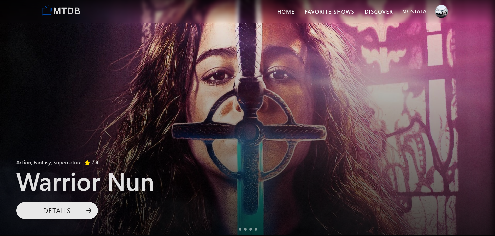

# MTDB - Track your Favorite TV Shows Here

## Image



## Description

This is a simple app that allows users to add and remove tv-show from their watchlist.
The user can also, search for shows by name.
The application uses the [TVmaze API](https://www.tvmaze.com/api) in order to fetch data about TV Shows.

## Technologies

FireBase (BackEnd For user management) + ReactJS + Redux + Axios + React-Bootstrap + React-Router-Dom + Swiper .

## Preview

you can preview the Website from [here](https://mtdb-app.onrender.com/).

## Installation instructions

1. Clone this repository into your local machine using `git clone "https://github.com/Mostafa-Y-Mansour/mtdb-app.git".
2. Run this commands in your terminal.
3. Make sure you have installed NodeJs & NPM firstly , if not go ahead and do so !

```bash
`npm install`  # to install Dependencies .
`npm run build`  # To Build The App.
```

4. After building you will find an index file inside dist folder which contains all of our code
   . Open it with any browser or use Live Server extension on VSCode.
5. You are ready now! Enjoy :)

### Note: If you want to make changes then please follow these steps :

6. Make sure you have installed NodeJs & NPM firstly , if not go ahead and do so !
   Then open up your Terminal / Command Prompt and type following command line :

```bash
`npm install` # Install dependencies
`npm start` # Start development server at localhost:3000
```

7. The App will be running on port **3000** of localhost at
   **"http://localhost:3000/"**.

## License & copyrights

This Web application is Build and Owned by `Mostafa Mansour`. You can check GitHub Profile [here](https://github.com/Mostafa-Y-Mansour/).
